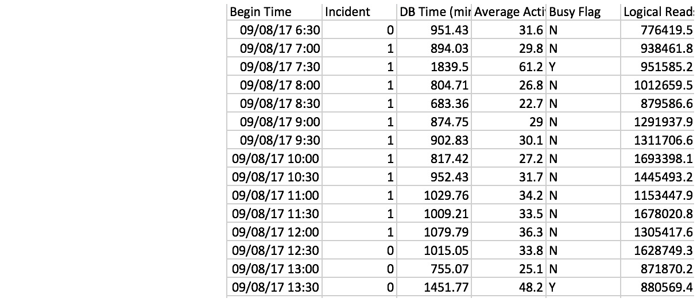
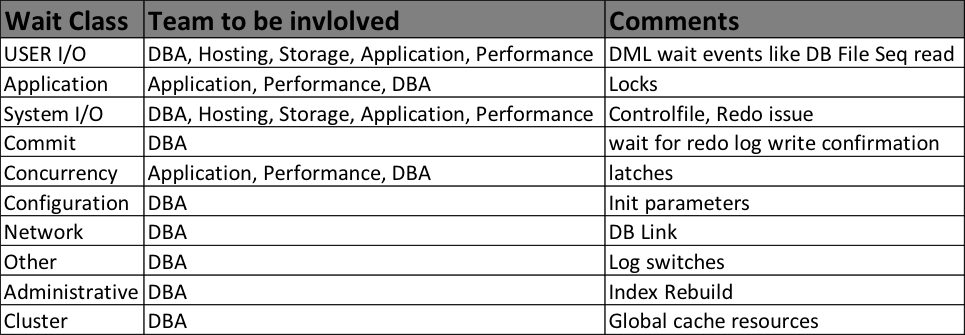
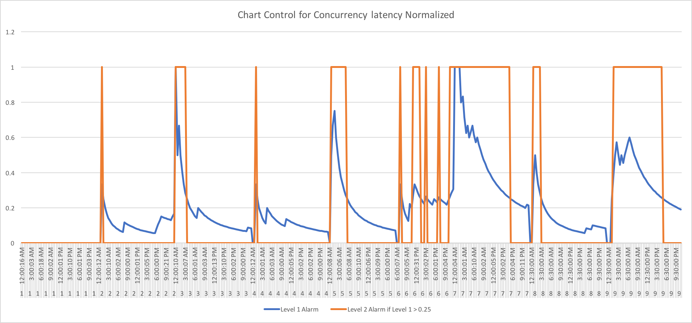

```{r setup, include=FALSE}
knitr::opts_chunk$set(echo = TRUE)
```
## Problem Statement
How do we quickly root cause an incident/outage in IT infrastructure?   
For this problem statement we analyzed all the incidents for a particular given time period and identified high priority incidents in the DBA queue. Identified some of the most critical databases in IT as candidates for this project.   

P.S: While the below prototype was developed at Cisco IT, some of the critical information like hostnames and database names are hidden/modified for security reasons.

## Our approach
We started with an analytical approach based on descriptive statistics and machine language to perform multi-dimensional analysis of historical performance data taken from Oracle’s Automatic Workload Repository (AWR). The goal is to provide a mechanism to visualise realtime, and compare present vs past data to further analyze and alert the stakeholders. The information is collated to proactively identify the problematic area, which will then help us to provide quick root cause of the problem by enabling us to onboard the right support team for the problem identified. This will lead to a faster MTTR.   

Further we can also forecast the future database resource usage and identify the time periods where we need to be on high alert. This is made possible by generating the baselines using the technique of moving averages of the database parameters over a moving window time period. Overall the solution will help us to optimise the end-use experience in IT. 

The approach is based on the following white paper published by KNIME analytics: https://files.knime.com/sites/default/files/inline-images/Anomaly_Detection_Time_Series_final.pdf  


```{r cg1_incidents, message=FALSE, warning=FALSE, results='hide'}
setwd(dir = "/Users/sapvenka/Desktop/Anomaly_detection")
library(readr)
library(DT)
DB_incidents <- read_csv("DB_incidents.csv")
```

In our given time period, two incidents happened due to performance issues on our database. Let us see if we can detect these incidents from our AWR report.

```{r view_cg1_incidents, result='asis'}
datatable(head(DB_incidents, 6), style="bootstrap", class="table-condensed table-stripe table-hover", options = list(dom = 'tp',scrollX = TRUE))
```

## Data Collection

Oracle generates systematic reports on the health check of a database. They are called Automatic Workload Repository (AWR). AWR reports are generated once in every 30 minutes. A typical AWR report looks like:
[Sample AWR report](https://oracle-base.com/articles/10g/awrrpt_demo.html).

We need to parse this report and extract the useful information into a CSV format for easier analysis. This cannot be done without the domain expertise on Oracle database administration. We automated this tedious task with the help of flashdba's [AWR Parser](https://github.com/flashdba/scripts/blob/master/awr-parser.sh).

When the AWR Parser reads a single report it condenses the entire contents into one single row in a csv file. This script is run against each AWR report to produce a single master CSV file.
Lets have a look at this master dataset.

```{r master, message=FALSE, warning=FALSE, results='hide'}
master_data <- read_csv("master_data.csv")
```

## Peek at the Master Dataset

```{r view_dataset, result='asis', echo=FALSE}
datatable(head(master_data, 430), style="bootstrap", class="table-condensed table-stripe table-hover", options = list(dom = 'tp',scrollX = TRUE))
```

Master dataset contains about 177 odd column names which can be broadly classified into the following categories:

1. Identifiers - AWR file name, Database name, Instance Name, Begin/End Snap ID, Begin/End Timestamp, etc
2. Session related Wait Events -  db file sequential read, TX enqueue row lock contention, SQL * net message from client 
3. Independent Key Metrics - Read Throughput, Write Throughput, Read IOPS, Write IOPS, Parses/Sec, User Calls/sec, User logins/sec, etc
4. Wait Classes - Every wait event belongs to a class of wait event. The following list describes each of the wait classes.   
**Administrative**   
Waits resulting from DBA commands that cause users to wait (for example, an index rebuild)   
**Application**   
Waits resulting from user application code (for example, lock waits caused by row level locking or explicit lock commands)   
**Cluster**   
Waits related to Real Application Cluster resources (for example, global cache resources such as 'gc cr block busy'   
**Commit**    
This wait class only comprises one wait event - wait for redo log write confirmation after a commit (that is, 'log file sync')    
**Concurrency**     
Waits for internal database resources (for example, latches)    
**Configuration**     
Waits caused by inadequate configuration of database or instance resources (for example, undersized log file sizes, shared pool size)    
**Idle**     
Waits that signify the session is inactive, waiting for work (for example, 'SQL*Net message from client')      
**Network**      
Waits related to network messaging (for example, 'SQL*Net more data to dblink')     
**Other**     
Waits which should not typically occur on a system (for example, 'wait for EMON to spawn')      
   

## Exploratory Analysis

```{r plot_graphs}
plot_db_cputime <- data.frame(master_data$`Begin Time`,master_data$`DB CPU Time (s)`)
plot(plot_db_cputime, type="o")

plot_active_sess <- data.frame(master_data$`Begin Time`,master_data$`Average Active Sessions`)
plot(plot_active_sess, type="l")

plot_io_latency <- data.frame(master_data$`Begin Time`,master_data$`Wait Class User I/O Latency (ms)`)
plot(plot_io_latency, type="p")

plot_admin_latency <- data.frame(master_data$`Begin Time`,master_data$`Wait Class Admin Latency (ms)`)
plot(plot_admin_latency, type="l")

plot_app_latency <- data.frame(master_data$`Begin Time`,master_data$`Wait Class Application Latency (ms)`)
plot(plot_app_latency, type="o")

plot_conc_latency <- data.frame(master_data$`Begin Time`,master_data$`Wait Class Concurrency Latency (ms)`)
plot(plot_conc_latency, type="l")
```

Specifically, prediction of “unknown” disruptive events in IT takes the name of “anomaly detection”.

## Supervised Anomaly Detection   

Based on the incident timings, we created a new column Incident with values 0 or 1.
Ran Decision Tree and Random forest for the data and the values are as below. 



Decision tree report captured from Rattle:


Supervised learning might not be a best suit for this project, since the incident root cause might be differenct for each incident and we need to keep learning . So, decided to go with unsupervised learning.   

We ran few models in the supervised learning to get some insights.  
For one database ORCLDB, Wait Class, USERIO was more significant than other wait classes.   
But for another database, Wait Class Concurrency was more significant.  
  
  
## Clustering

If there is any problem in the DB, one of the wait events will be very significant. In Oracle, each wait event is grouped under a wait class.  
So we finalized to model on the wait classes, since all wait events belong to a wait class. Also, it was found that one of the Wait Classes were significant in each incident in the supervised learning.  
   
Moving away from supervised anomaly detection, where one class is just labeled as anomaly, but examples of that class exist in historical data, we concentrate here on dynamic unsupervised anomaly detection.

If we get input data during an incident, we can run through each of the wait classes to determine if there is a problem in the DB or not using unsupervised Anamoly detection.


  

## Dynamic Unsupervised Anomaly Detection

In a dynamic unsupervised anomaly detection, the word “dynamic” means that we approach the problem from a time perspective. Attributes and their evolutions are observed over time before the catastrophic previously unseen event occurs. The word “unsupervised” means that we are trying to predict an event that has no examples in the data history. So, the strategy involves monitoring the attribute evolutions over time in the anomaly-free historical data. Indeed deviations from the historical attribute evolutions can be warning signs of a future anomaly; these warning signs can then be used to trigger a generic anomaly alarm, requiring further checkups.

Courtesy: https://files.knime.com/sites/default/files/inline-images/Anomaly_Detection_Time_Series_final.pdf

```{r cg1_conc_latency, message=FALSE, warning=FALSE, results='hide'}
DB_conc_latency <- read_csv("DB_10days.csv")
```


```{r view_conc_latency, result='asis'}
datatable(head(DB_conc_latency, 413), style="bootstrap", class="table-condensed table-stripe table-hover", options = list(dom = 'tp',scrollX = TRUE))
```
   



If we recall the incidents reported on ORCLDB during the mentioned time period:  

```{r view_cg1_incidents2, result='asis'}
datatable(head(DB_incidents, 6), style="bootstrap", class="table-condensed table-stripe table-hover", options = list(dom = 'tp',scrollX = TRUE))
```


     
With our Chart Control method we are able to detect the incidents couple of hours before it could be reported.  
   
   
We also explored the packages like Twitter and Netflix packages to automate the solution.   
References:   
    
     
Anamoly detection with Twitter Package: https://anomaly.io/anomaly-detection-twitter-r/       
https://github.com/twitter/AnomalyDetection    
        
https://blog.twitter.com/engineering/en_us/a/2015/introducing-practical-and-robust-anomaly-detection-in-a-time-series.html     
      
Anamoly detection with Netflix RAD Outlier Detection:  https://medium.com/netflix-techblog/rad-outlier-detection-on-big-data-d6b0494371cc  

https://github.com/Netflix/Surus   


## Twitter Package:

```{r Twitter, message=FALSE, warning=FALSE, results='hide'}
library(AnomalyDetection)
DB_con_latency_10days <- data.frame(DB_conc_latency$`Wait Class Concurrency Latency (ms)`)
```
  
  
```{r Twitter_results_from_1stAug_to_9thAug}
res = AnomalyDetectionVec(DB_con_latency_10days,max_anoms=0.01,period=48, direction='both', plot = T )
res$plot
```
  

## Netflix Package:   

```{r Netflix_results_10days}
library(RAD)
library(devtools)
ggplot_AnomalyDetection.rpca(AnomalyDetection.rpca(DB_con_latency_10days, frequency = 48, autodiff = T,  forcediff = F, scale = T,verbose=F,L.penalty =.05,s.penalty = 10/sqrt(max(48, ifelse(is.data.frame(DB_con_latency_10days), nrow(DB_con_latency_10days),length(DB_con_latency_10days))/48))))
```


##  Inference:

Both Twitter package and Netflix is able to detect the anomaly and was able to map to the DB related incidents. Final decision is to use netflix package, since it has better control on the threshold limits.


